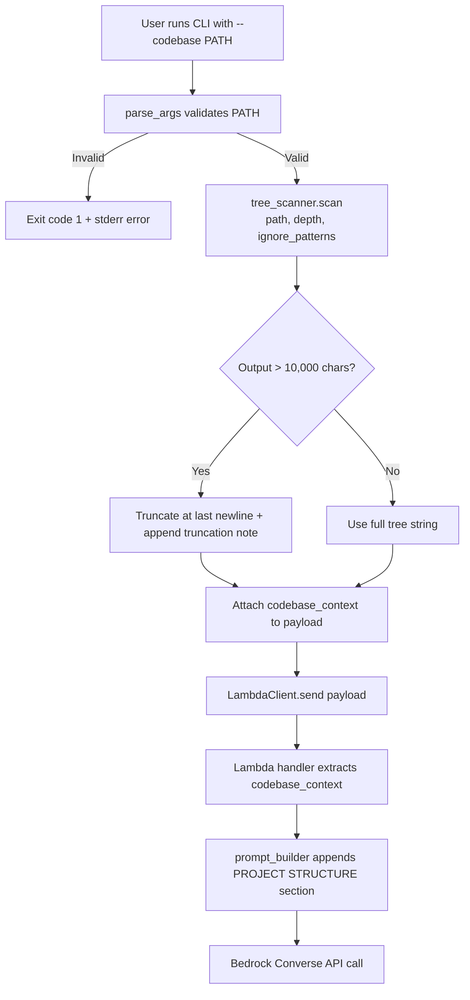

# Design Document: Codebase Context

## Overview

The Codebase Context feature extends SprintMaster's CLI with a `--codebase <PATH>` flag that scans a project directory's structure (names only, not file contents) and injects a tree representation into the user message sent to the Lambda/Bedrock backend. This allows the LLM to reference real file paths and module names when generating agile tickets.

The feature introduces a new `tree_scanner` module responsible for directory traversal, ignore-pattern handling (default patterns + `.gitignore`), depth limiting, and output truncation. The CLI orchestrates scanning, and the resulting tree string flows through the existing `LambdaClient` → Lambda handler → `prompt_builder` pipeline.

### Design Decisions

1. **Separate `tree_scanner` module** — Keeps directory traversal logic isolated from CLI argument handling, enabling independent unit and property testing.
2. **`pathspec` library for gitignore matching** — Industry-standard Python package that faithfully implements `.gitignore` glob syntax (negations, `**` wildcards, trailing slashes), avoiding brittle custom regex.
3. **Character-based truncation with line-boundary snapping** — Guarantees no filename is cut mid-line while staying within a safe token budget for the LLM.
4. **Root-level `.gitignore` only** — Deliberate simplification for v1; avoids recursive gitignore resolution complexity while covering the most common use case.

## Architecture



### Data Flow

1. CLI parses `--codebase` and `--codebase-depth` arguments.
2. CLI calls `tree_scanner.scan(path, depth_limit, ignore_patterns)` which returns a `ScanResult`.
3. CLI adds `codebase_context` field to the Lambda payload dictionary.
4. Lambda handler passes the field to `build_messages`.
5. `build_messages` appends a `PROJECT STRUCTURE:` section to the user message.

## Components and Interfaces

### 1. CLI Extension (`sprintmaster/cli.py`)

New arguments added to `parse_args`:

```python
parser.add_argument(
    "--codebase",
    metavar="PATH",
    default=None,
    help="Path to project directory to scan for context",
)
parser.add_argument(
    "--codebase-depth",
    metavar="N",
    type=int,
    default=4,
    help="Maximum directory depth for tree scan (default: 4)",
)
```

Validation in `main()`:
- If `--codebase` is provided, resolve to absolute path. If path does not exist or is not a directory, print error to stderr and exit with code 1.
- If `--codebase-depth` is < 1, print error to stderr and exit with code 1.

### 2. Tree Scanner Module (`sprintmaster/tree_scanner.py`)

New module with the following public interface:

```python
@dataclass
class ScanResult:
    """Result of a directory tree scan."""
    tree: str               # The formatted tree representation
    total_entries: int      # Total files + directories found
    truncated: bool         # Whether output was truncated
    truncated_count: int    # Number of entries not shown due to truncation

def scan(
    root: Path,
    depth_limit: int = 4,
    extra_ignore_patterns: list[str] | None = None,
    max_chars: int = 10_000,
) -> ScanResult:
    """Scan a directory tree and return a formatted representation.
    
    Args:
        root: The root directory to scan.
        depth_limit: Maximum depth of recursion (1 = root only).
        extra_ignore_patterns: Additional pathspec patterns to exclude.
        max_chars: Maximum character count before truncation.
    
    Returns:
        ScanResult with the tree string and metadata.
    """
```

Internal helper functions:

```python
def _load_gitignore(root: Path) -> pathspec.PathSpec | None:
    """Load and parse the root .gitignore file if it exists."""

def _build_default_spec() -> pathspec.PathSpec:
    """Build a PathSpec from the hardcoded default ignore patterns."""

def _walk(
    directory: Path,
    root: Path,
    depth: int,
    depth_limit: int,
    ignore_spec: pathspec.PathSpec,
    prefix: str,
    lines: list[str],
    visited: set[str],
) -> int:
    """Recursively walk the directory, appending tree lines.
    
    Returns the count of entries added.
    """
```

### 3. Lambda Handler Update (`lambda/handler.py`)

Pass `codebase_context` from the event body to `build_messages`:

```python
codebase_context = body.get("codebase_context")
system_prompt, messages = build_messages(
    feature_description, team_config, language=language,
    codebase_context=codebase_context,
)
```

### 4. Prompt Builder Update (`lambda/prompt_builder.py`)

Add `codebase_context` parameter to `build_messages`:

```python
def build_messages(
    feature_description: str,
    team_config: dict | None,
    language: str | None = None,
    codebase_context: str | None = None,
) -> tuple[str, list]:
```

When `codebase_context` is provided and non-empty, append to the user message:

```python
CODEBASE_CONTEXT_TEMPLATE = """

PROJECT STRUCTURE:
```
{tree}
```
"""
```

## Data Models

### ScanResult (new dataclass in `tree_scanner.py`)

| Field            | Type  | Description                                  |
|------------------|-------|----------------------------------------------|
| `tree`           | `str` | Full tree-drawing string with connectors     |
| `total_entries`  | `int` | Count of all entries discovered              |
| `truncated`      | `bool`| Whether the output was truncated             |
| `truncated_count`| `int` | Entries not shown (only set when truncated)  |

### Lambda Payload Extension

The existing payload dictionary gains one optional field:

```json
{
  "feature_description": "...",
  "team_config": { ... },
  "model_id": "...",
  "language": "English",
  "codebase_context": "myproject/\n├── src/\n│   ├── main.py\n│   └── utils.py\n└── tests/\n    └── test_main.py"
}
```

### Default Ignore Patterns (constants in `tree_scanner.py`)

```python
DEFAULT_IGNORE_DIRS = [
    ".git", "node_modules", "__pycache__", ".venv", "venv",
    ".env", ".tox", ".mypy_cache", ".pytest_cache", "dist",
    "build", ".next", ".nuxt", "target", "bin/Debug",
    "bin/Release", "obj",
]

DEFAULT_IGNORE_FILES = [
    ".DS_Store", "Thumbs.db", "*.pyc", "*.pyo",
]
```

## Correctness Properties

*A property is a characteristic or behavior that should hold true across all valid executions of a system — essentially, a formal statement about what the system should do. Properties serve as the bridge between human-readable specifications and machine-verifiable correctness guarantees.*

### Property 1: Completeness — no silent omissions

*For any* directory tree and depth limit, every file and directory within the depth limit that does not match any ignore pattern (default or gitignore) SHALL appear in the Tree_Representation output.

**Validates: Requirements 2.1, 9.2**

### Property 2: Soundness — no fabricated entries

*For any* directory scanned by the Tree_Scanner, every file or directory name extracted from the Tree_Representation SHALL correspond to an actual entry on disk at the expected relative path.

**Validates: Requirements 9.1**

### Property 3: Sorting invariant

*For any* directory level in the Tree_Representation, all directory entries SHALL appear before all file entries, and within each group (directories, files) entries SHALL be sorted alphabetically.

**Validates: Requirements 2.3**

### Property 4: Root name as first line

*For any* scanned directory, the first line of the Tree_Representation SHALL be exactly the root directory name (basename of the scanned path).

**Validates: Requirements 2.5**

### Property 5: No file contents leaked

*For any* directory tree where files contain non-empty content, the Tree_Representation SHALL not contain any substring matching any file's content (only names appear).

**Validates: Requirements 2.4**

### Property 6: Default ignore exclusion

*For any* directory tree containing entries whose names match the default ignore patterns (e.g., `node_modules`, `__pycache__`, `.git`, `*.pyc`), neither the matching entries nor their descendants SHALL appear in the Tree_Representation.

**Validates: Requirements 3.1, 3.2, 3.3**

### Property 7: Gitignore combined exclusion

*For any* directory tree with a root `.gitignore` file, entries matching gitignore patterns SHALL be excluded from the Tree_Representation, and this exclusion SHALL be applied in addition to (not instead of) the default ignore patterns.

**Validates: Requirements 4.1, 4.4**

### Property 8: Gitignore comment lines are non-matching

*For any* `.gitignore` file containing lines that start with `#`, those lines SHALL not cause any file or directory to be excluded from the Tree_Representation (they are treated as comments).

**Validates: Requirements 4.5**

### Property 9: Depth limiting

*For any* directory tree and depth limit N, no entry at depth greater than N SHALL appear in the Tree_Representation, AND directories at exactly depth N SHALL appear by name but their contents SHALL not be listed.

**Validates: Requirements 5.2, 5.3**

### Property 10: Truncation correctness

*For any* Tree_Representation that exceeds 10,000 characters, the output SHALL be truncated at the last newline before the 10,000-character boundary (no partial lines), and a truncation indicator line SHALL be appended.

**Validates: Requirements 6.1, 6.2, 6.3**

### Property 11: Payload passthrough

*For any* non-empty tree string produced by the scanner, the `codebase_context` field in the Lambda payload SHALL contain exactly that tree string with no modifications.

**Validates: Requirements 7.1, 7.2**

### Property 12: Prompt formatting

*For any* non-empty codebase_context string passed to the prompt builder, the resulting user message SHALL contain a `PROJECT STRUCTURE:` header followed by the tree string wrapped in a code block.

**Validates: Requirements 8.2, 8.3**

### Property 13: Invalid path rejection

*For any* path string that does not correspond to an existing directory on disk, the CLI SHALL exit with code 1 and print an error message to stderr.

**Validates: Requirements 1.3, 1.4**

### Property 14: Invalid depth rejection

*For any* integer value less than 1 provided as `--codebase-depth`, the CLI SHALL exit with code 1 and print an error message to stderr.

**Validates: Requirements 5.4**

## Error Handling

| Scenario | Component | Behavior |
|----------|-----------|----------|
| `--codebase` path does not exist | CLI (`main`) | Print `"Error: codebase path does not exist: <path>"` to stderr, exit code 1 |
| `--codebase` path is not a directory | CLI (`main`) | Print `"Error: codebase path is not a directory: <path>"` to stderr, exit code 1 |
| `--codebase-depth` < 1 | CLI (`main`) | Print `"Error: --codebase-depth must be at least 1"` to stderr, exit code 1 |
| `.gitignore` file cannot be read (permission error) | `tree_scanner` | Log warning (if verbose), proceed with default patterns only |
| Circular symlink encountered | `tree_scanner._walk` | Skip the symlink entry, track visited real paths in `visited` set, continue scanning |
| `pathspec` raises on malformed gitignore line | `tree_scanner._load_gitignore` | Log warning (if verbose), skip the malformed line |
| OS permission denied on a subdirectory | `tree_scanner._walk` | Skip the inaccessible directory, continue scanning siblings |
| Tree output exceeds 10,000 characters | `tree_scanner.scan` | Truncate at last newline boundary, append truncation note, set `truncated=True` in result |

### Error Propagation Strategy

- **CLI-level validation errors** (bad path, bad depth) halt execution immediately with exit code 1.
- **Scanner-level transient errors** (permission denied, bad symlink) are handled gracefully — the scanner continues and logs warnings in verbose mode. The scan never raises exceptions that abort the entire CLI run.
- **Lambda-level** — no new error cases. The `codebase_context` field is optional; absence means the prompt builder simply skips the section.

## Testing Strategy

### Unit Tests (example-based)

| Test | Validates |
|------|-----------|
| `--codebase` flag accepted with valid path | Req 1.1, 1.2 |
| `--codebase` flag missing → no codebase_context in payload | Req 1.5, 7.3 |
| Path is a file (not directory) → exit code 1 | Req 1.4 |
| Default depth value is 4 | Req 5.1 |
| Circular symlink is skipped gracefully | Req 2.6 |
| `.gitignore` not present → defaults only | Req 4.3 |
| Empty lines in `.gitignore` don't cause errors | Req 4.6 |
| Lambda handler passes codebase_context to build_messages | Req 8.1 |
| build_messages without codebase_context → message unchanged | Req 8.4 |
| Truncation with verbose mode logs warning | Req 6.4 |

### Property-Based Tests (Hypothesis)

The project already uses **Hypothesis** (>= 6.0) for property-based testing (see `tests/property/`). Each property test runs a minimum of **100 iterations**.

| Test File | Properties Covered |
|-----------|-------------------|
| `tests/property/test_tree_scanner.py` | Properties 1–10 |
| `tests/property/test_codebase_payload.py` | Properties 11, 12, 13, 14 |

**Test configuration:**
- Library: `hypothesis` (already in dev dependencies)
- Minimum iterations: 100 per property (`@settings(max_examples=100)`)
- Each test is tagged with a comment: `# Feature: codebase-context, Property N: <title>`

**Generator strategy:**
- Use `hypothesis` + `tmp_path` fixture to create random directory structures with varying:
  - File/directory names (alphabetic, with special chars)
  - Tree depth (1 to 8 levels)
  - Number of entries per level (0 to 20)
  - Presence/absence of `.gitignore` with random patterns
  - Entries matching default ignore patterns
  - File content (random bytes for property 5)

### Integration Tests

| Test | Validates |
|------|-----------|
| End-to-end: CLI with `--codebase` sends correct payload to Lambda mock | Req 7.1, 7.2, 8.1 |
| Lambda handler + prompt_builder produces correctly formatted message | Req 8.2, 8.3 |

