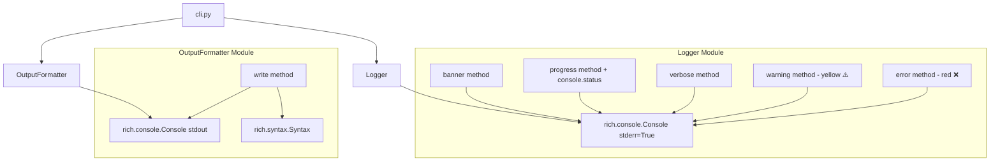

# Design Document: Rich Console UI

## Overview

This design integrates the [Rich](https://rich.readthedocs.io/) library into SprintMaster's CLI to replace plain `print()` calls with styled, color-aware terminal output. The integration touches two existing modules — `Logger` and `OutputFormatter` — adding visual enhancements (colored messages, startup banner, animated spinner, syntax-highlighted output) while preserving backward compatibility with non-TTY environments and existing verbosity contracts.

The approach wraps Rich's `Console` object behind the existing public API of each module, so callers (primarily `cli.py`) require zero changes. When the terminal does not support styling (piped output, non-TTY stderr/stdout), Rich automatically degrades to plain text, satisfying the graceful-fallback requirements.

## Architecture



### Key Design Decisions

1. **Two Console instances**: Logger uses `Console(stderr=True)` while OutputFormatter uses `Console(file=sys.stdout)`. This preserves the existing separation where diagnostic output goes to stderr and ticket data goes to stdout.

2. **Backward-compatible API**: The public method signatures of `Logger` and `OutputFormatter` remain unchanged. Callers do not need modifications.

3. **Rich handles TTY detection**: `Console` automatically detects whether its output file is a terminal. When it is not (piped, redirected), it strips ANSI escape codes. This satisfies requirements 3.3, 4.2, and 7.3 without manual TTY checks.

4. **Spinner lifecycle via context manager**: The `console.status()` context manager manages the spinner animation. The Logger exposes `start_progress(msg)` and `stop_progress()` helper methods alongside a context-manager interface so `cli.py` can wrap the Lambda call in a spinner block.

5. **No Rich markup in file output**: When `--output` is specified, OutputFormatter writes plain YAML/JSON directly with `open()`, bypassing the Rich Console entirely.

## Components and Interfaces

### Logger (sprintmaster/logger.py)

```python
from rich.console import Console

class Logger:
    """Verbosity-aware logger using Rich Console for styled stderr output."""

    def __init__(self, *, verbose: bool = False, quiet: bool = False) -> None:
        self._verbose = verbose
        self._quiet = quiet
        self._console = Console(stderr=True)
        self._status = None  # Active status context (spinner)

    # --- Properties (unchanged) ---
    @property
    def is_verbose(self) -> bool: ...

    @property
    def is_quiet(self) -> bool: ...

    # --- New method ---
    def banner(self) -> None:
        """Print 'SprintMaster' in bold + color. Suppressed in quiet mode."""
        if not self._quiet:
            self._console.print("SprintMaster", style="bold cyan")

    # --- Modified methods ---
    def progress(self, msg: str) -> None:
        """Display progress with animated spinner. Suppressed in quiet mode."""
        if self._quiet:
            return
        # Uses console.status() for animated spinner display
        ...

    def start_progress(self, msg: str) -> None:
        """Start an animated spinner with the given message."""
        if self._quiet:
            return
        self._status = self._console.status(msg)
        self._status.start()

    def stop_progress(self) -> None:
        """Stop the current animated spinner if one is active."""
        if self._status:
            self._status.stop()
            self._status = None

    def verbose(self, msg: str) -> None:
        """Print verbose info. Only when verbose=True and not quiet."""
        if self._quiet or not self._verbose:
            return
        self._console.print(msg, style="dim")

    def warning(self, msg: str) -> None:
        """Print '⚠️ Warning: {msg}' in yellow. Always shown."""
        self._console.print(f"⚠️ Warning: {msg}", style="yellow")

    def error(self, msg: str) -> None:
        """Print '❌ Error: {msg}' in red. Always shown."""
        self._console.print(f"❌ Error: {msg}", style="bold red")

    def verbose_metadata(self, *, model_id, region, input_tokens, output_tokens, processing_time) -> None:
        """Print metadata lines via verbose(). Unchanged contract."""
        ...
```

### OutputFormatter (sprintmaster/output_formatter.py)

```python
import sys
from rich.console import Console
from rich.syntax import Syntax
from rich.text import Text

class OutputFormatter:
    """Handles parsing, validation, and rich-styled serialization of ticket data."""

    def __init__(self) -> None:
        self._stdout_console = Console(file=sys.stdout)

    # --- parse_and_validate: unchanged ---
    def parse_and_validate(self, raw: dict) -> list[Ticket]: ...

    # --- Modified write method ---
    def write(self, tickets: list[Ticket], args: argparse.Namespace) -> None:
        """Serialize tickets with optional Rich styling.

        - YAML to stdout + TTY: syntax highlighting via Syntax, bold cyan keys
        - YAML to stdout + non-TTY: plain text (no ANSI)
        - YAML/JSON to file: plain text always
        - Visual spacing: one blank line between consecutive tickets
        """
        ...

    def _render_yaml_highlighted(self, tickets_data: list[dict]) -> None:
        """Render YAML with syntax highlighting and bold ticket keys to stdout."""
        ...

    def _render_plain(self, tickets_data: list[dict], output_format: str, output_path: str | None) -> None:
        """Render plain text to stdout or file."""
        ...
```

### Interface Contract Summary

| Method | Input | Output | Side Effects |
|--------|-------|--------|-------------|
| `Logger.banner()` | None | None | Prints styled "SprintMaster" to stderr |
| `Logger.progress(msg)` | str | None | Shows msg on stderr (spinner in TTY) |
| `Logger.start_progress(msg)` | str | None | Starts animated spinner on stderr |
| `Logger.stop_progress()` | None | None | Stops active spinner |
| `Logger.warning(msg)` | str | None | Prints "⚠️ Warning: {msg}" yellow to stderr |
| `Logger.error(msg)` | str | None | Prints "❌ Error: {msg}" red to stderr |
| `OutputFormatter.write(tickets, args)` | list[Ticket], Namespace | None | Writes styled/plain output to stdout or file |

## Data Models

No new data models are introduced. The existing `Ticket` pydantic model remains the canonical data structure. The design adds Rich rendering on top of the existing serialization pipeline.

### Configuration State

```python
# Logger internal state
class Logger:
    _verbose: bool       # --verbose flag
    _quiet: bool         # --quiet flag
    _console: Console    # Rich Console(stderr=True)
    _status: Status | None  # Active spinner context

# OutputFormatter internal state
class OutputFormatter:
    _stdout_console: Console  # Rich Console(file=sys.stdout)
```

### Ticket Key Constants

The six ticket keys that receive bold cyan styling are defined as a constant:

```python
TICKET_KEYS = {"title", "description", "acceptance_criteria", "story_points", "priority", "assignee"}
```

## Correctness Properties

*A property is a characteristic or behavior that should hold true across all valid executions of a system — essentially, a formal statement about what the system should do. Properties serve as the bridge between human-readable specifications and machine-verifiable correctness guarantees.*

### Property 1: Verbosity mode controls message visibility

*For any* message string and any combination of (verbose, quiet) flags, the Logger SHALL:
- Show progress messages only when quiet=False
- Show verbose messages only when verbose=True AND quiet=False
- Show warning messages regardless of mode
- Show error messages regardless of mode

**Validates: Requirements 1.2, 4.4**

### Property 2: Error message format preservation

*For any* non-empty message string passed to `Logger.error(msg)`, the output text SHALL contain the substring `❌ Error: {msg}` where `{msg}` is the exact input string unmodified.

**Validates: Requirements 3.2**

### Property 3: Warning message format preservation

*For any* non-empty message string passed to `Logger.warning(msg)`, the output text SHALL contain the substring `⚠️ Warning: {msg}` where `{msg}` is the exact input string unmodified.

**Validates: Requirements 4.3**

### Property 4: File output contains no ANSI escape sequences

*For any* list of valid tickets written to a file (via `--output`), the file content SHALL contain no ANSI escape sequences (no bytes matching the pattern `\x1b[...m`) and SHALL be valid YAML or JSON parseable by standard libraries.

**Validates: Requirements 6.2, 7.3**

### Property 5: Ticket spacing invariant

*For any* list of N valid tickets (N ≥ 1) rendered to output, the formatted content SHALL contain exactly max(0, N-1) blank-line separators between consecutive ticket blocks, with no blank line before the first ticket and no blank line after the last ticket.

**Validates: Requirements 8.1, 8.2, 8.3, 8.4**

### Property 6: Serialization round-trip through formatting

*For any* valid Ticket object, serializing it to YAML via OutputFormatter and then parsing the plain-text content back with `yaml.safe_load` SHALL produce a dictionary with the same keys and values as `ticket.model_dump(mode="json")`.

**Validates: Requirements 6.2, 8.1**

## Error Handling

### Logger Error Scenarios

| Scenario | Behavior |
|----------|----------|
| Rich library not installed | ImportError at module load — caught by Python's import system. pyproject.toml ensures installation. |
| Console write failure (broken pipe) | Rich raises `BrokenPipeError`. The Logger does not catch this — Python's default signal handling applies (silent exit). This matches current behavior. |
| Invalid style string | Would raise `StyleSyntaxError` at construction time. Since styles are hardcoded constants, this is a development-time bug, not a runtime concern. |

### OutputFormatter Error Scenarios

| Scenario | Behavior |
|----------|----------|
| Syntax highlighting fails | Fallback to plain text rendering. Wrap `Syntax()` call in try/except. |
| stdout not writable | `Console.print()` raises IOError — same behavior as current `sys.stdout.write()`. |
| Empty ticket list | Never reaches `write()` — `parse_and_validate()` exits with `EXIT_SERVICE_ERROR` if no valid tickets remain. |

### Graceful Degradation Strategy

Rich's `Console` automatically handles:
- Non-TTY output → strips all ANSI codes
- Terminals with limited color support → downgrades to supported palette
- Windows legacy terminals → uses Windows Console API or falls back to plain text

No additional error handling code is needed for these cases.

## Testing Strategy

### Unit Tests (pytest)

Unit tests cover specific examples and edge cases:

- **Logger banner**: Verify "SprintMaster" appears in stderr output; verify suppressed in quiet mode
- **Logger error/warning icons**: Verify ❌ and ⚠️ icons present in formatted output
- **Non-TTY degradation**: Use `Console(no_color=True)` or `StringIO` to verify no ANSI in output
- **OutputFormatter file output**: Write to temp file, verify valid YAML/JSON with no ANSI
- **Single ticket spacing**: No blank lines around single ticket
- **Spinner lifecycle**: Mock `console.status()` to verify start/stop called appropriately

### Property-Based Tests (hypothesis)

Property-based testing is appropriate for this feature because:
- Message formatting has clear input/output behavior (string → formatted string)
- Verbosity rules are universal across all inputs
- Spacing rules must hold for any number/content of tickets
- Serialization round-trip must hold for any valid ticket

**Configuration:**
- Minimum 100 iterations per property test
- Library: `hypothesis` (already in dev dependencies)
- Each property test references its design document property
- Tag format: **Feature: rich-console-ui, Property {number}: {property_text}**

**Property test implementations:**

1. **Verbosity visibility** — Generate random (verbose, quiet, message) triples. Assert correct output/suppression per mode rules.
2. **Error format** — Generate random strings via `hypothesis.strategies.text()`. Assert output contains `❌ Error: {input}`.
3. **Warning format** — Generate random strings. Assert output contains `⚠️ Warning: {input}`.
4. **File output plain text** — Generate random valid tickets (using a Ticket strategy). Write to temp file. Assert no `\x1b` bytes in file content and content is parseable YAML.
5. **Ticket spacing** — Generate lists of 1-10 valid tickets. Render to string. Assert separator count = len(tickets) - 1. Assert no leading/trailing blank lines.
6. **Serialization round-trip** — Generate random Ticket objects. Serialize via OutputFormatter plain mode. Parse back. Assert equality.

### Integration Tests

- **End-to-end CLI run**: Invoke `sprintmaster` with mock Lambda, verify styled output on TTY-like console
- **Spinner animation**: Verify no crash/hang when progress is started and stopped rapidly
- **Piped output**: Run CLI with stdout piped, verify clean parseable YAML/JSON with no escape codes

### Test Helpers

```python
# Strategy for generating valid Ticket objects
from hypothesis import strategies as st
from sprintmaster.models import Ticket, Priority, FIBONACCI

ticket_strategy = st.builds(
    Ticket,
    title=st.text(min_size=1, max_size=100),
    description=st.text(min_size=1, max_size=500),
    acceptance_criteria=st.lists(st.text(min_size=1, max_size=200), min_size=1, max_size=5),
    story_points=st.sampled_from(sorted(FIBONACCI)),
    priority=st.sampled_from(list(Priority)),
    assignee=st.text(min_size=1, max_size=50).filter(lambda s: s.strip()),
)
```

